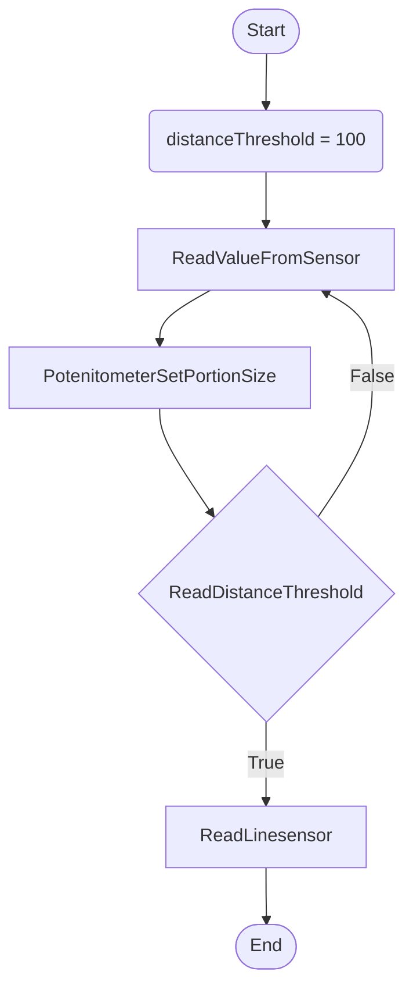
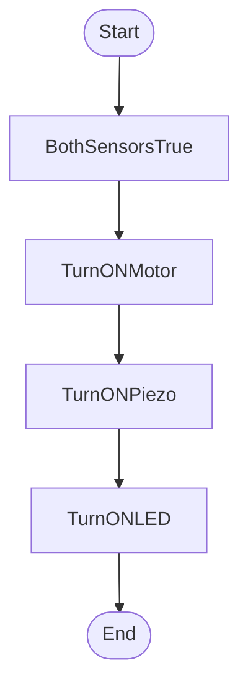
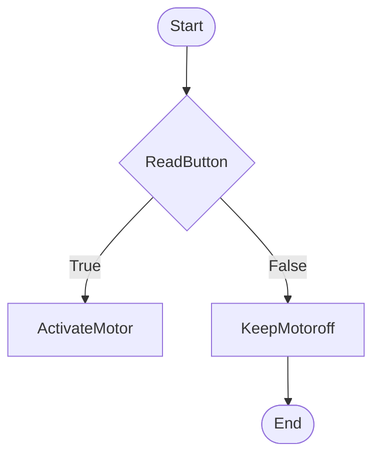
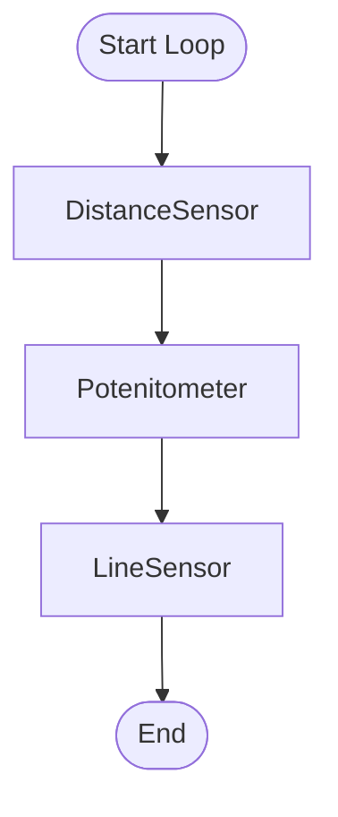
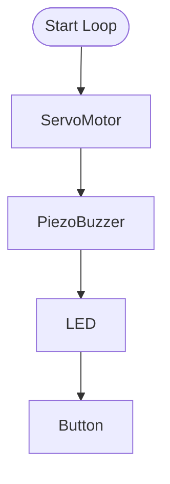

Behaviour 1. When someone arrives in the driveway activate sonar. If sonar is active and Line sensor is active start the fish feeder 

Behaviour 2. When Fish feeder active activate motor to drop food in tank and alert completetion by turing on a buzzer and light

Behaviour 3. If button is pressed drop food in tank

Sensor Loop

Loop when feeder is activated

