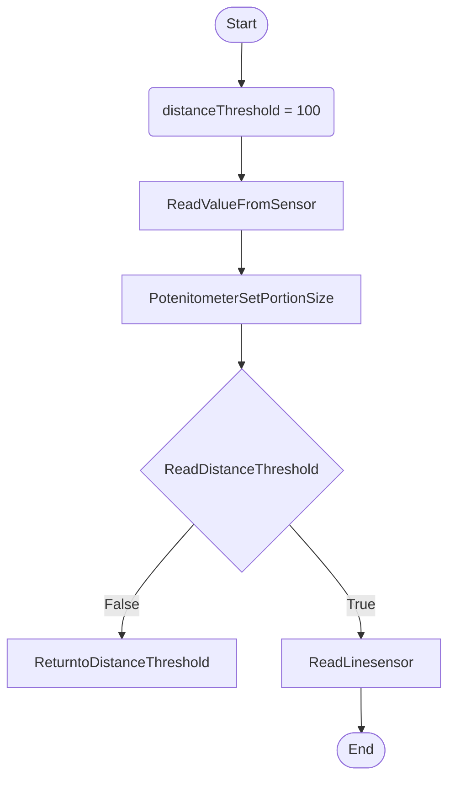
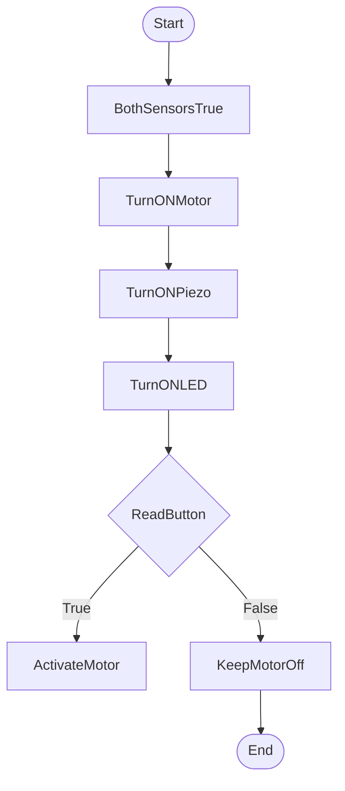
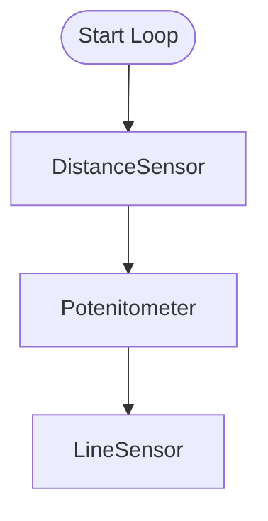

```mermaid
flowchart TD
terminalStart([Start])
terminalEnd([End])
terminalStart --> thresholdSet(distanceThreshold = 100)
thresholdSet --> ReadValueFromSensor
-->
PotenitometerSetPortionSize
-->
ifDistanceLessThanThreshold{ReadDistanceThreshold} 
ifDistanceLessThanThreshold --> |False| ReturntoDistanceThreshold
ifDistanceLessThanThreshold --> |True| ReadLinesensor 
--> terminalEnd([End])
```


``` mermaid
flowchart TD
terminalStart([Start])
terminalEnd([End])
terminalStart --> BothSensorsTrue
--> TurnONMotor
--> TurnONPiezo
--> TurnONLED
-->
ButtonActivate{ReadButton}
ButtonActivate --> |True| ActivateMotor
ButtonActivate --> |False| KeepMotorOff
-->terminalEnd

```


``` mermaid
flowchart TD
terminalStart([Start Loop])
terminalStart([Start Loop])
-->
DistanceSensor
--> Potenitometer
--> LineSensor
```

``` mermaid
flowchart TD
terminalStart([Start Loop])
terminalStart([Start Loop])
-->
ServoMotor
--> PiezoBuzzer
--> LED
--> Button